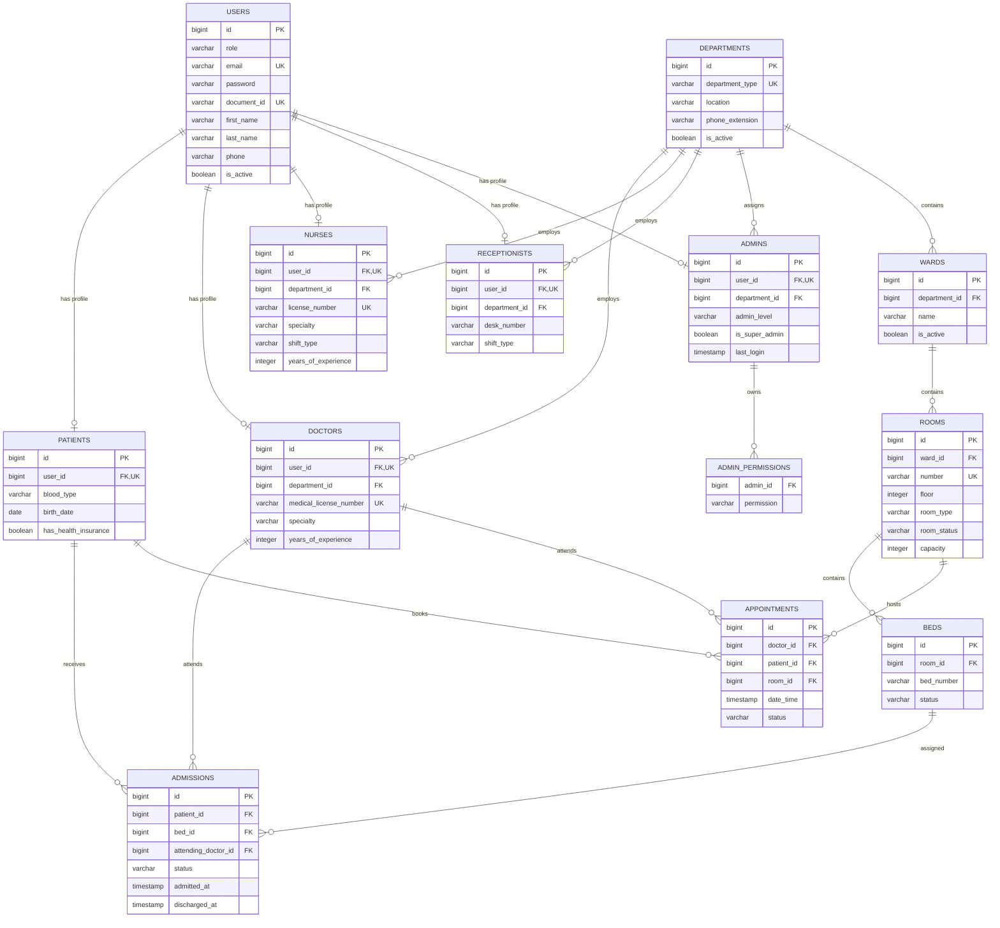

# Hospital Management API

REST API for hospital management built with Java, Spring Boot and PostgreSQL.

The system manages users, administrators, patients, doctors, nurses, receptionists, departments, wards, rooms, beds, admissions and medical appointments.

## Main features

- Stateless authentication with JWT.
- Role-based authorization with Spring Security.
- Fine-grained administrator permissions.
- Secure password storage with BCrypt.
- Login attempt protection.
- CRUD operations for hospital resources.
- Pagination, filtering and sorting.
- Bean Validation and centralized error handling.
- Pessimistic locking for concurrent updates.
- Database migrations with Flyway.
- OpenAPI and Swagger UI in development.
- Unit, repository and integration testing.
- Real PostgreSQL integration tests with Testcontainers.
- Multi-stage Docker image.
- Docker Compose environment.
- Development, testing and production profiles.
- Secure initial administrator bootstrap.
- Structured production logging.

## Technology stack

| Technology | Purpose |
|---|---|
| Java 21 | Programming language |
| Spring Boot 4.1 | Application framework |
| Spring Web MVC | REST API |
| Spring Data JPA | Persistence |
| Hibernate | ORM |
| Spring Security | Authentication and authorization |
| JWT / JJWT | Access tokens |
| PostgreSQL 18 | Relational database |
| Flyway | Database migrations |
| Bean Validation | Request and entity validation |
| Lombok | Boilerplate reduction |
| Springdoc OpenAPI | API documentation |
| JUnit 5 | Testing |
| Mockito | Unit testing |
| MockMvc | Controller integration testing |
| Testcontainers | PostgreSQL integration testing |
| Maven Wrapper | Build and dependency management |
| Docker | Application packaging |
| Docker Compose | Local production-like environment |

## Architecture

The project uses a modular layered architecture:

```text
HTTP request
    ↓
Security filters
    ↓
Controller
    ↓
Service
    ↓
Repository
    ↓
PostgreSQL
```

Each business module contains its own controller, DTOs, mapper, service, repository and entity where applicable.

```text
src/main/java/com/hospital/gestion
├── GestionApplication.java
└── api
    ├── admin
    ├── admission
    ├── appointment
    ├── auth
    ├── bed
    ├── common
    ├── config
    ├── doctor
    ├── nurse
    ├── patient
    ├── receptionist
    ├── room
    ├── security
    ├── user
    └── ward
```

## Domain model



## Business rules enforced by the database

The initial Flyway migration includes indexes, foreign keys, checks and conditional unique constraints.

Important guarantees include:

- A user can have only one profile of each professional type.
- User emails and document identifiers are unique.
- Medical and nursing license numbers are unique.
- A department administrator must belong to a department.
- A bed can have only one active admission.
- A patient can have only one active admission.
- Doctors cannot have two active appointments at the same time.
- Patients cannot have two active appointments at the same time.
- Rooms cannot host two active appointments at the same time.
- Room capacity must be greater than zero.
- Admission discharge time cannot precede admission time.

## API modules

| Base path | Module |
|---|---|
| `/api/auth` | Authentication |
| `/api/users` | Users |
| `/api/admins` | Administrators and permissions |
| `/api/patients` | Patients |
| `/api/doctors` | Doctors |
| `/api/nurses` | Nurses |
| `/api/receptionists` | Receptionists |
| `/api/departments` | Departments |
| `/api/wards` | Wards |
| `/api/rooms` | Rooms |
| `/api/beds` | Beds |
| `/api/admissions` | Admissions |
| `/api/appointments` | Appointments |

The controllers also expose resource-specific searches, counts, pagination, sorting, status transitions and filters.

## Security

The API uses stateless JWT authentication.

Public endpoints:

```text
POST /api/auth/login
GET  /swagger-ui/**     development only
GET  /v3/api-docs/**    development only
```

All other endpoints require authentication.

Supported roles include:

```text
ADMIN
DOCTOR
NURSE
RECEPTIONIST
PATIENT
```

Administrative levels:

```text
SUPER_ADMIN
SYSTEM_ADMIN
DEPARTMENT_ADMIN
```

Fine-grained administrative permissions are supported for users, roles, doctors, nurses, patients, departments, rooms, appointments, system configuration, audit logs, settings, statistics and reports.

## Authentication example

Login:

```bash
read -s "PASSWORD?Password: "
echo

AUTH_RESPONSE="$(
  jq -n \
    --arg email "admin@hospital.com" \
    --arg password "$PASSWORD" \
    '{email: $email, password: $password}' |
  curl -sS \
    -X POST \
    http://localhost:8080/api/auth/login \
    -H "Content-Type: application/json" \
    --data-binary @-
)"

unset PASSWORD

echo "$AUTH_RESPONSE" |
jq
```

Extract the token:

```bash
ACCESS_TOKEN="$(
  echo "$AUTH_RESPONSE" |
  jq -r '.accessToken'
)"
```

Call a protected endpoint:

```bash
curl -i \
  http://localhost:8080/api/departments \
  -H "Authorization: Bearer $ACCESS_TOKEN"
```

Remove shell variables afterward:

```bash
unset AUTH_RESPONSE ACCESS_TOKEN
```

## Application profiles

| Profile | Purpose | Swagger | SQL logging |
|---|---|---:|---:|
| `dev` | Local development | Enabled | Enabled |
| `test` | Automated tests | Disabled | Disabled |
| `prod` | Docker/production | Disabled | Disabled |

The default profile is `dev`.

## Running locally

### Requirements

- Java 21
- Docker
- PostgreSQL 18, or compatible PostgreSQL version
- `jq` for the shell examples

Configure the database through environment variables if your local credentials differ from the development defaults:

```bash
export DB_URL='jdbc:postgresql://localhost:5432/hospital?currentSchema=public'
export DB_USERNAME='hospital'
export DB_PASSWORD='your_local_password'
export JWT_SECRET="$(openssl rand -base64 32)"
```

Start the application:

```bash
./mvnw spring-boot:run \
  -Dspring-boot.run.profiles=dev
```

Development documentation:

```text
http://localhost:8080/swagger-ui.html
http://localhost:8080/v3/api-docs
```

## Running with Docker Compose

Create your private environment file:

```bash
cp .env.example .env
```

Generate a secure JWT secret:

```bash
openssl rand -base64 32
```

Edit `.env` and replace all placeholder credentials:

```bash
nano .env
```

Build and start the services:

```bash
docker compose up \
  --build \
  --detach
```

Check their health:

```bash
docker compose ps
```

Expected services:

```text
hospital-postgres   healthy
hospital-api        healthy
```

View API logs:

```bash
docker compose logs \
  --follow \
  api
```

Stop the environment without deleting database data:

```bash
docker compose down
```

Delete the environment and its database volume only when intentional:

```bash
docker compose down --volumes
```

> Warning: `--volumes` permanently deletes the Docker PostgreSQL data.

## Initial administrator

A new production database contains no users. The first administrator is therefore created through a temporary bootstrap process.

Set these values in `.env` before the first startup:

```dotenv
BOOTSTRAP_ADMIN_ENABLED=true
BOOTSTRAP_ADMIN_EMAIL=admin@example.com
BOOTSTRAP_ADMIN_PASSWORD=replace_with_a_strong_unique_password
BOOTSTRAP_ADMIN_DOCUMENT_ID=ADMIN001
BOOTSTRAP_ADMIN_FIRST_NAME=System
BOOTSTRAP_ADMIN_LAST_NAME=Administrator
BOOTSTRAP_ADMIN_PHONE=
```

Start the API and verify that the administrator can log in.

Immediately afterward, disable the bootstrap and remove its plaintext password:

```dotenv
BOOTSTRAP_ADMIN_ENABLED=false
BOOTSTRAP_ADMIN_PASSWORD=
```

Recreate only the API container:

```bash
docker compose up \
  --detach \
  --force-recreate \
  api
```

The administrator remains stored in PostgreSQL with a BCrypt password hash.

## Environment variables

| Variable | Required in production | Description |
|---|:---:|---|
| `DB_URL` | Yes | PostgreSQL JDBC URL |
| `DB_USERNAME` | Yes | Database username |
| `DB_PASSWORD` | Yes | Database password |
| `JWT_SECRET` | Yes | Base64 JWT signing secret |
| `JWT_EXPIRATION_MS` | No | Access token lifetime |
| `JWT_ISSUER` | No | JWT issuer |
| `CORS_ALLOWED_ORIGINS` | Yes | Accepted frontend origins |
| `SERVER_PORT` | No | Published API port |
| `DB_POOL_MIN_SIZE` | No | Minimum Hikari pool size |
| `DB_POOL_MAX_SIZE` | No | Maximum Hikari pool size |
| `LOGIN_MAX_ATTEMPTS` | No | Maximum failed login attempts |
| `LOGIN_ATTEMPT_WINDOW_MS` | No | Failed-attempt window |
| `LOGIN_BLOCK_DURATION_MS` | No | Account blocking duration |
| `ROOT_LOG_LEVEL` | No | Root logging level |
| `APP_LOG_LEVEL` | No | Application logging level |
| `BOOTSTRAP_ADMIN_ENABLED` | No | Enables initial admin creation |

Never commit `.env` or real credentials.

## Database migrations

Flyway migrations are located in:

```text
src/main/resources/db/migration
```

Current migration:

```text
V1__init_schema.sql
```

Hibernate uses:

```yaml
ddl-auto: validate
```

Therefore Flyway owns schema creation and Hibernate verifies that entities match the migrated schema.

## Testing

Run the complete test suite:

```bash
./mvnw clean verify
```

Current result:

```text
Tests run: 426
Failures: 0
Errors: 0
BUILD SUCCESS
```

The project includes:

- Service unit tests with JUnit and Mockito.
- JWT and authorization tests.
- Repository tests against real PostgreSQL.
- Controller integration tests with MockMvc.
- Authentication integration tests.
- Security integration tests.
- Testcontainers using PostgreSQL 18.4.

Run a specific test:

```bash
./mvnw \
  -Dtest=DepartmentServiceTest \
  test
```

Run an integration test:

```bash
./mvnw \
  -Dtest=DepartmentControllerIntegrationTest \
  test
```

## Build

Create the executable JAR:

```bash
./mvnw clean package
```

Generated artifact:

```text
target/gestion-0.0.1-SNAPSHOT.jar
```

Run the JAR:

```bash
java -jar \
  target/gestion-0.0.1-SNAPSHOT.jar
```

## Docker image

The `Dockerfile` uses two stages:

1. Java 21 JDK to compile and package the application.
2. Java 21 JRE to run the final artifact.

The runtime container:

- Contains no compiler or Maven installation.
- Runs as the non-root `hospital` user.
- Exposes only port `8080`.
- Uses external environment variables.
- Writes logs to standard output.
- Includes an application health check.

## Error responses

Errors are handled centrally and returned as JSON.

Authentication error example:

```json
{
  "status": 401,
  "message": "Authentication is required"
}
```

Authorization error example:

```json
{
  "status": 403,
  "message": "Access denied"
}
```

Resource error example:

```json
{
  "status": 404,
  "message": "Resource not found",
  "timestamp": "2026-09-03T19:44:21"
}
```

## Production considerations

Before deploying publicly:

- Use a strong unique database password.
- Generate a secure JWT secret.
- Use HTTPS through a reverse proxy or cloud load balancer.
- Restrict CORS to the real frontend domain.
- Keep Swagger disabled.
- Keep administrator bootstrap disabled.
- Store secrets in the deployment platform's secret manager.
- Back up the PostgreSQL volume.
- Monitor container health and application logs.
- Apply Flyway migrations before or during controlled deployments.
- Never expose the PostgreSQL port publicly.

## Project status

```text
API and domain model             Complete
JWT security                     Complete
Role authorization               Complete
Pagination and filters           Complete
Swagger and OpenAPI              Complete
Postman verification             Complete
Unit tests                       Complete
Repository integration tests     Complete
Controller integration tests     Complete
Testcontainers PostgreSQL        Complete
Development/test/prod profiles   Complete
Docker and Docker Compose        Complete
Production logging               Complete
Initial administrator bootstrap Complete
```
